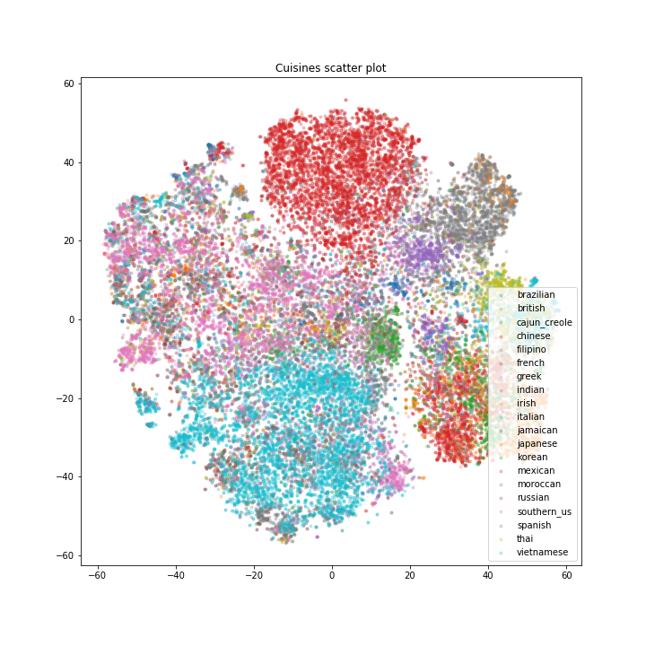

# WhatsCooking
Predicting cuisine based on ingredients in a recipe
This is a small project based on a kaggle competition https://www.kaggle.com/c/whats-cooking.

## Cooking.ipynb
Reading and preprocessing the dataset, and using logistic regression and neural network classifiers to predict the cuisine.

## Word2Vec.ipynb
Ingredients in a recipe are much like words in a sentence. Word2Vec was used to generate ingredient embeddings, which were "tested" using gensim functions like similarity between vectors, or summing vectors. Recipe embeddings were made as a sum of ingredients, and plotted using TSNE to reduce them to two dimensions.

